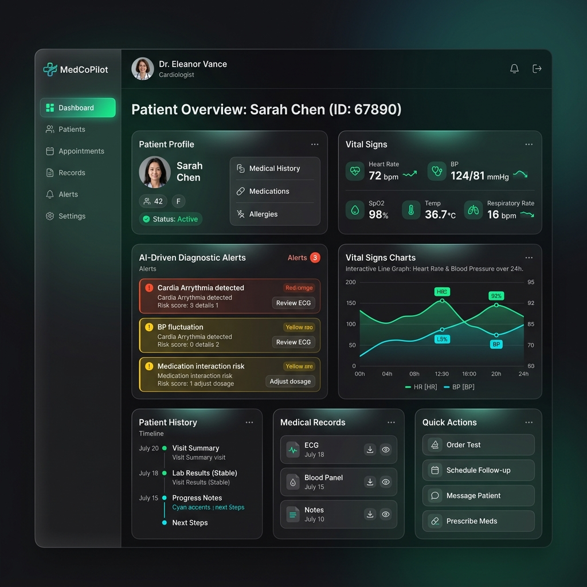

# 🚀 MedCoPilot (Code-Nakshatra)
**The Ultimate AI-Powered Clinical Decision Support System**



## 📖 Overview
**MedCoPilot** provides an all-in-one AI medical co-pilot engineered to transform the healthcare workflow for doctors, particularly targeting Tier-2/3 cities in India. Designed with a sleek, user-friendly interface, it removes clutter and replaces it with intelligent automation—from real-time differential diagnosis and drug safety checks to automated SOAP note generation and PDF report formatting.

## ✨ Core Features in Detail

### 1. 🎨 The Entrance: Premium UX & Design 
- **Glassmorphism UI**: A clean, "Evergreen Wellness" themed interface providing a clutter-free, highly professional dark/light mode environment suited for busy clinical settings.

### 2. 🧠 The Multi-Modal AI Diagnostic Engine

Built for top-notch medical accuracy, our dual AI pipeline analyzes multiple input formats:
- **NLP Symptom Extractor**: Processes chaotic textual or transcribed speech input, pulling critical symptoms automatically using a trained Natural Language Processing model.
- **X-Ray Vision**: Uses a trained Convolutional Neural Network (CNN) built with PyTorch to read uploaded X-Ray scans and provides a real-time anomaly verdict (e.g., Normal vs. Pneumonia).
- **Knowledge Base**: Employs Qdrant Vector Store and a Neo4j Graph Database under the hood to deeply correlate symptoms with complex medical data.

### 3. 🛡️ Safety First: Drug-Drug Interaction Checker

When doctors prescribe medications, our Drug Safety Module actively intercepts and checks components against the graph database. If a high-risk combination (e.g., Warfarin + Aspirin) is detected, the system immediately flags a **Severe Alert**, acting as a real-time safeguard for patient lives.

### 4. 📝 Automated Clinical Documentation (SOAP Notes)
Zero manual effort required. By utilizing LangChain and LLMs like Anthropic Claude, the system silently writes up **Subjective, Objective, Assessment, and Plan (SOAP)** notes from the ongoing consultation context, saving the doctor immense documentation time.

### 5. 🏥 Smart Patient Context Dashboard
Direct integration with PostgreSQL smoothly pulls up past visits, historical vitals, and documented allergies instantly. Doctors never have to fetch multiple files—all vital info is proactively displayed on-screen.

### 6. 📄 One-Click Digital Medical Report
As the session concludes, with a single click, it produces a hospital-branded, professional-looking Medical Report. This print-ready PDF is elegantly formatted, adding a tangible "Wow" factor that exhibits extreme professionalism to patients.

---

## 🛠️ Tech Stack & Architecture

### **Frontend & UI**
   

- **Framework**: Next.js 16.2.2, React 19
- **Styling**: Tailwind CSS v4, Framer Motion (Micro-animations), Radix UI (Accessible components)
- **State Management**: Zustand (Client), React Query (Server Sync)

### **Backend & AI Core**
   

- **Web App Backend**: Next.js API Routes (Serverless)
- **AI Inference Service**: Python 3.14, FastAPI framework
- **Machine Learning**: PyTorch (Vision CNN proxy), Scikit-Learn (NLP & TF-IDF Vectors), Pandas, Numpy
- **Generative AI Logic**: LangChain, Anthropic Claude SDK, Groq SDK
- **OCR Engine**: Tesseract (PyTesseract) & Google Cloud Vision

### **Databases & Infra**
    

- **Relational DB**: PostgreSQL (via Supabase) with Row-Level Security
- **Graph DB**: Neo4j (Used for mapping diseases and tracking drug interactions)
- **Vector DB**: Qdrant (Used for embedding similarities)
- **Event Streaming**: Apache Kafka & Zookeeper 
- **Caching**: Redis
- **Containerization**: Docker Compose

---

## 🚀 Procedure to Run Locally

Follow these steps to get MedCoPilot running on your local machine:

### Prerequisites:
- **Node.js**: v18+
- **Python**: v3.10+
- **Docker Desktop**: Installed and running

### Step 1: Clone the Repository
```bash
git clone <repository_url>
cd Code-Nakshatra
```

### Step 2: Environment Variables
Create a `.env` file in the root directory (and make sure to add it to `/backend/ai-inference-service` if needed) with the necessary keys. Based on `docker-compose.yml`, you will need:
```env
POSTGRES_USER=postgres
POSTGRES_PASSWORD=your_password
POSTGRES_DB=medcopilot
NEO4J_AUTH=neo4j/your_neo4j_password
ANTHROPIC_API_KEY=your_anthropic_key
GROQ_API_KEY=your_groq_key
QDRANT_URL=your_qdrant_url
QDRANT_API_KEY=your_qdrant_api_key
NEO4J_URI=bolt://neo4j:7687
NEO4J_USER=neo4j
NEO4J_PASSWORD=your_neo4j_password
```

### Step 3: Start Infrastructure Services
Run the Docker containers holding PostgreSQL, Redis, Kafka, Zookeeper, Neo4j, and the AI Inference Service.
```bash
docker-compose up -d
```

### Step 4: Install Dependencies & Setup Database
Install the Node modules for the Next.js app:
```bash
npm install
```
Setup the database tables by executing the database script (assuming you have psql installed):
```bash
psql -h localhost -U postgres -d medcopilot -f scripts/schema.sql
```

### Step 5: (Optional) Train the Local Machine Learning NLP Model
If you want to re-train the local NLP models (TF-IDF vectors and labels):
```bash
npm run train-nlp
# Or run: python scripts/train_nlp_model.py
```

### Step 6: Start the Application App
```bash
npm run dev
```
Open your browser and navigate to `http://localhost:3000`. You are now ready to test MedCoPilot!

---
*© 2026 MedCoPilot AI (Code-Nakshatra). Built for the future of Indian Healthcare.*
