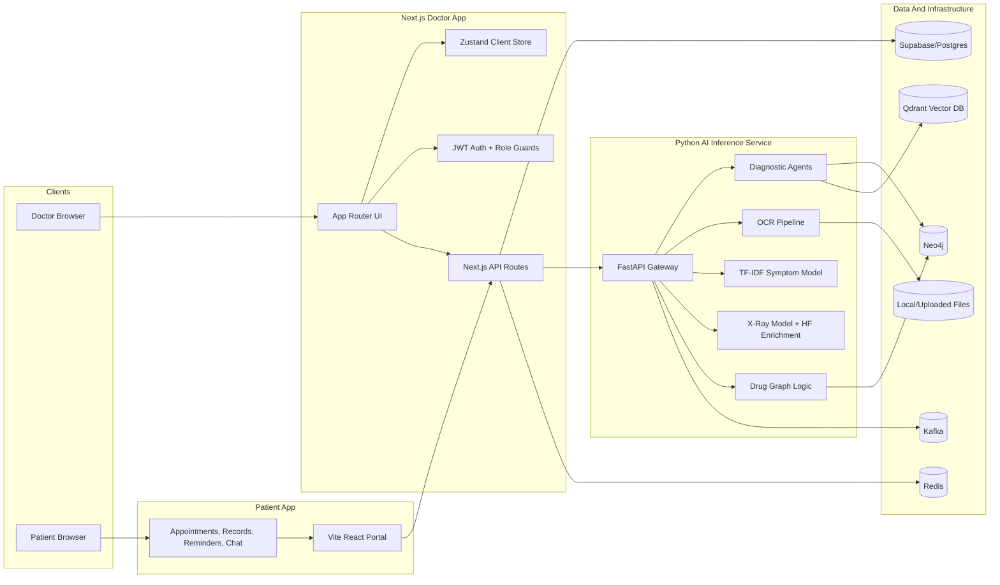
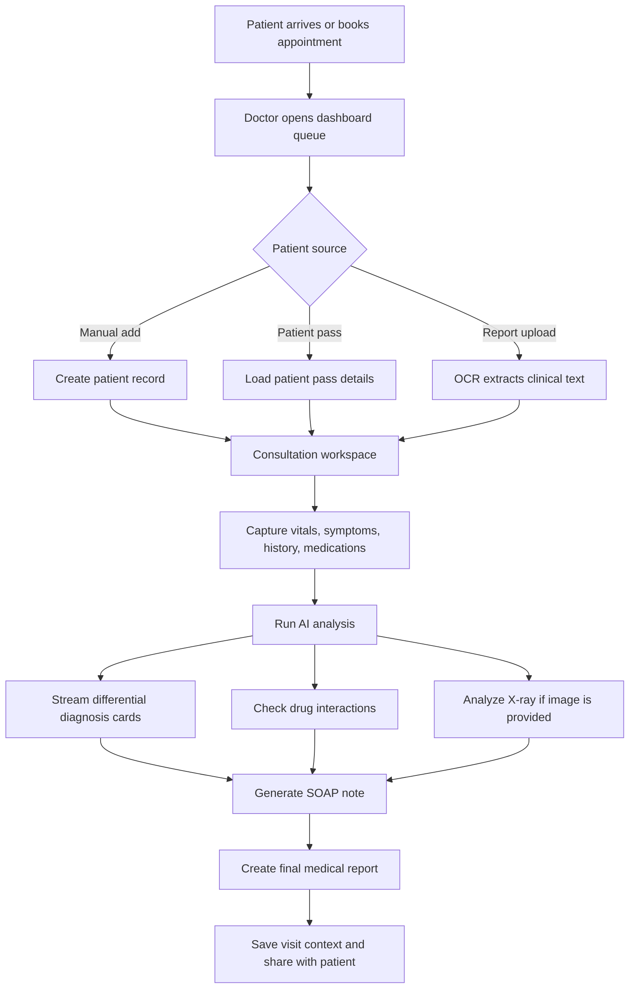
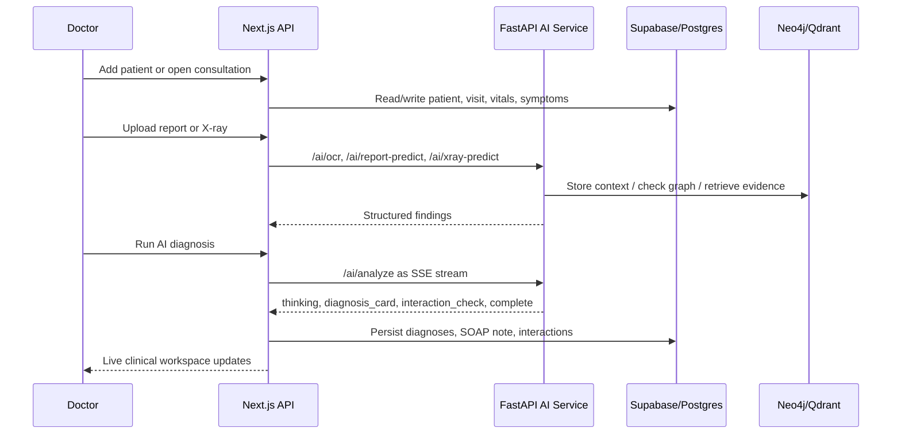
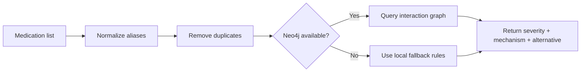
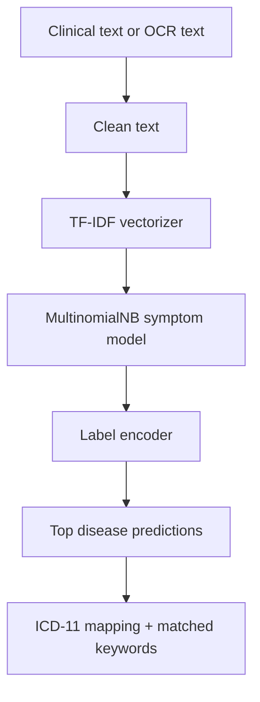
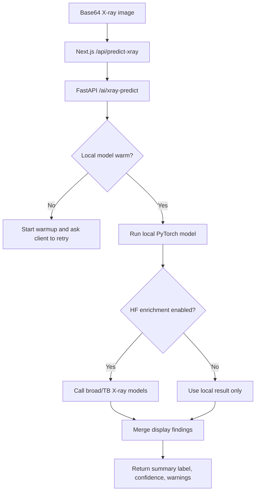
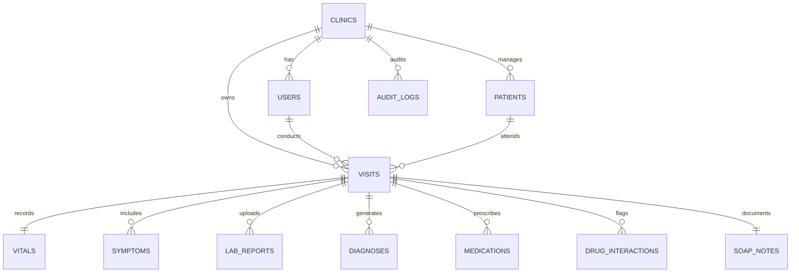
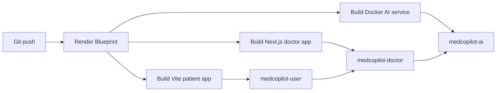

# MedCoPilot

AI-assisted clinical workflow platform for doctors, clinics, and patients.


MedCoPilot combines a doctor dashboard, patient portal, and Python AI inference service into one clinical decision-support workflow. It helps a clinician onboard a patient, extract report data, review symptoms and vitals, run diagnostic assistance, check drug interactions, analyze X-ray images, generate SOAP notes, and produce a patient-friendly medical report.

> Safety note: MedCoPilot is a clinical decision-support and hackathon/demo system. It should not be used as a replacement for licensed medical judgment, emergency care, or regulatory-approved diagnostic devices.

## Table Of Contents

- [Highlights](#highlights)
- [Product Screens](#product-screens)
- [Tech Stack](#tech-stack)
- [System Architecture](#system-architecture)
- [Clinical Workflow](#clinical-workflow)
- [Feature Deep Dive](#feature-deep-dive)
- [AI And ML Pipelines](#ai-and-ml-pipelines)
- [API Surface](#api-surface)
- [Data Model](#data-model)
- [Project Structure](#project-structure)
- [Local Setup](#local-setup)
- [Environment Variables](#environment-variables)
- [Deployment](#deployment)
- [Demo Accounts](#demo-accounts)
- [Roadmap](#roadmap)

## Highlights

| Area | What It Does | Key Files |
| --- | --- | --- |
| Doctor dashboard | Queue, patient records, consultation workspace, analytics, notifications, medical report generation | `app/(dashboard)`, `components/layout`, `components/modals` |
| Patient portal | Patient-friendly dashboard, appointment booking, report upload, medical records, reminders, chat assistant | `components/patient-portal`, `user-healthcare-main` |
| AI diagnosis | Streams clinical reasoning events and differential diagnosis cards over SSE | `app/api/ai/analyze`, `backend/ai-inference-service/agents.py` |
| SOAP notes | Generates structured Subjective, Objective, Assessment, Plan documentation | `app/api/ai/soap`, `lib/services/ai-service.ts` |
| Drug safety | Searches drug catalog, normalizes aliases, checks interaction pairs through Neo4j or fallback rules | `app/api/drugs`, `lib/services/drug-service.ts` |
| Report OCR | Extracts clinical text and fields from uploaded reports using OCR and AI summarization | `app/api/ai/ocr`, `backend/ai-inference-service/ocr.py` |
| Symptom NLP | Predicts disease candidates from text or OCR output using TF-IDF and Scikit-learn artifacts | `scripts/train_nlp_model.py`, `backend/ai-inference-service/report_inference.py` |
| X-ray analysis | Runs local chest X-ray model and optional Hugging Face enrichment | `app/api/predict-xray`, `backend/ai-inference-service/xray_inference.py` |
| Analytics | Daily volume, diagnosis distribution, top interactions, outbreak signal placeholders, forecasting | `app/api/analytics`, `lib/services/analytics-service.ts` |
| Deployment | Render blueprint for doctor app, static patient app, and Dockerized AI backend | `render.yaml` |

## Product Screens

### Doctor Dashboard


### X-Ray Analysis


### Drug Interaction Alert


## Tech Stack

| Layer | Technology |
| --- | --- |
| Doctor web app | Next.js App Router, React 19, TypeScript, Tailwind CSS, Framer Motion, Radix UI, Lucide icons |
| Patient web app | Vite, React 19, Tailwind CSS, Recharts, Lucide icons |
| Client state | Zustand, React Query patterns, local persistence bridge |
| API layer | Next.js route handlers, server-side service modules, SSE responses |
| Auth | JWT access/refresh tokens, HTTP-only cookies, role-aware route guards |
| AI service | FastAPI, Pydantic, SSE Starlette, Python inference modules |
| LLM integrations | Anthropic SDK, LangChain, Groq integration hooks |
| ML | Scikit-learn TF-IDF classifier, PyTorch X-ray model, optional Hugging Face enrichment |
| OCR | Tesseract/PyTesseract, Google Cloud Vision support, PDF/image processing |
| Data | Supabase/Postgres, Neo4j, Qdrant, local JSON stores |
| Infra | Docker Compose, Redis, Kafka, Zookeeper, Render deployment blueprint |

## System Architecture



## Clinical Workflow



### Sequence View



## Feature Deep Dive

### 1. Doctor Queue And Consultation Workspace

- Role-aware dashboard for doctors, admins, and patient users.
- Patient queue with status filters, urgency flags, assigned doctor metadata, and search-ready UI.
- Consultation view combines history, symptoms, vitals, lab report text, X-ray results, diagnoses, interactions, and generated notes.
- One-click patient onboarding from manual entry, uploaded report, or patient pass.

### 2. Patient Portal

- Patient dashboard, medical records, appointment booking, notifications, settings, help center, medicine reminders, and chat assistant.
- Dedicated patient layout and bottom navigation for mobile-first use.
- Doctor handoff through patient pass routes: `app/patient-pass/[patientCode]`.
- Separate deployable Vite version in `user-healthcare-main` for a standalone patient app.

### 3. AI Diagnostic Assistance

- Streams progress states so the doctor sees the AI thinking flow in real time.
- Builds a clinical context from patient details, chief complaint, vitals, symptoms, medications, and lab reports.
- Returns likely diagnoses with probability, confidence, ICD-11 code, tags, and reasoning.
- Supports local trained model prediction for report text plus LLM-assisted clinical workflows.

### 4. Drug Safety Engine

- Accepts two or more drugs and normalizes aliases like `acetaminophen` to `Paracetamol`.
- Uses Neo4j when available for graph-backed interaction checks.
- Falls back to an embedded high-value interaction rule set if the graph service is unavailable.
- Reports drugs checked, pair count, unsafe interactions, safe combinations, severity, mechanism, clinical significance, and safer alternatives.



### 5. Report OCR And Symptom Prediction

- Uploads report images or PDFs to the AI service.
- Extracts raw text, clinical fields, confidence, and summary.
- Can run disease prediction from text or image-derived text through the trained TF-IDF model.
- Training corpus lives in `ml/extracted_corpus.csv`.

### 6. X-Ray Analysis

- Accepts base64 chest X-ray images from the web app.
- Loads local PyTorch model artifacts from `backend/ai-inference-service/models`.
- Returns top class, confidence, warning states, display findings, and processing metadata.
- Can enrich output through Hugging Face broad chest X-ray and TB models when configured.

### 7. Analytics

- Overview cards for total patients, AI analyses, flagged interactions, and average confidence.
- Daily patient/visit volume for the last 30 days.
- Diagnosis distribution for primary diagnoses.
- Top drug interaction pairs for the current month.
- Forecast endpoint exposed through the AI service for future predictive analytics.

## AI And ML Pipelines

### Text Report Prediction



Artifacts:

| Artifact | Purpose |
| --- | --- |
| `ml/extracted_corpus.csv` | Training corpus for symptom/report classification |
| `ml/tfidf_vectorizer.pkl` | Converts text into TF-IDF features |
| `ml/symptom_nlp_model.pkl` | Primary Multinomial Naive Bayes classifier |
| `ml/label_encoder.pkl` | Maps numeric model labels to disease names |
| `ml/disease_keywords.json` | Top terms per disease for explainability |
| `backend/ai-inference-service/ml/*` | Runtime copy used by the AI service |

Retrain:

```bash
npm run train-nlp
```

### X-Ray Prediction



Artifacts:

| Artifact | Purpose |
| --- | --- |
| `backend/ai-inference-service/models/xray_model.pth` | Local X-ray model weights |
| `backend/ai-inference-service/models/xray_class_names.json` | Class names used by the model |
| `backend/ai-inference-service/models/xray_model_metrics.json` | Training/evaluation metadata |
| `backend/ai-inference-service/models/xray_request_log.json` | Runtime request log |

## API Surface

### Next.js API Routes

| Route | Method | Purpose |
| --- | --- | --- |
| `/api/auth/[...route]` | mixed | Login, register, refresh, logout |
| `/api/patients` | GET/POST | List and create patients |
| `/api/patients/[id]` | GET/PUT | Read or update a patient |
| `/api/patients/[id]/visits` | GET/POST | List or create visits for a patient |
| `/api/visits/[id]` | GET | Get a visit with vitals, symptoms, medications, diagnoses, SOAP notes, reports, interactions |
| `/api/visits/[id]/vitals` | POST | Upsert visit vitals |
| `/api/visits/[id]/symptoms` | POST | Add symptoms |
| `/api/visits/[id]/medications` | POST | Add medications |
| `/api/visits/[id]/status` | PATCH | Move visit between waiting, in progress, completed |
| `/api/ai/analyze` | POST | Proxy streamed diagnostic analysis to FastAPI |
| `/api/ai/soap` | POST | Generate SOAP notes |
| `/api/ai/ocr` | POST | Proxy report OCR |
| `/api/ai/add-patient` | POST | OCR-driven patient onboarding |
| `/api/ai/patient/[patientId]` | DELETE | Remove patient data from AI-side stores |
| `/api/predict-report` | POST | Predict disease from text or report image |
| `/api/predict-xray` | GET/POST | Check X-ray model health or run X-ray prediction |
| `/api/drugs/search` | GET | Search drug catalog |
| `/api/drugs/check` | POST | Check drug-drug interactions |
| `/api/analytics/*` | GET | Overview, daily volume, diagnosis distribution, top interactions, outbreak signals |
| `/api/doctor-inbox` | GET/POST | Doctor inbox notifications |
| `/api/patient-pass` | POST | Create or manage patient pass handoff |
| `/api/doctors` | GET | Return clinicians for booking flows |

### FastAPI AI Service

| Route | Method | Purpose |
| --- | --- | --- |
| `/health` | GET | Service health check |
| `/ai/analyze` | POST | SSE diagnostic pipeline |
| `/ai/forecast` | GET | Forecasting data for a topic |
| `/ai/ocr` | POST | OCR report upload |
| `/ai/add-patient` | POST | OCR + graph/vector onboarding |
| `/ai/patient/{patient_id}` | DELETE | Delete patient data from Neo4j/Qdrant |
| `/ai/drugs/search` | GET | Drug catalog search |
| `/ai/drugs/check` | POST | Drug interaction analysis |
| `/ai/drugs/status` | GET | Drug graph stats |
| `/ai/report-predict` | POST | Symptom/report classifier |
| `/ai/xray-predict` | POST | X-ray prediction |
| `/ai/xray-health` | GET | X-ray model loading and metrics |

## Data Model



The full SQL schema is in `scripts/schema.sql`.

## Project Structure

```text
MediCopilot/
  app/                         Next.js App Router pages and API routes
  app/(dashboard)/             Protected doctor/patient dashboard screens
  app/api/                     Server-side API layer and AI proxies
  backend/ai-inference-service/ FastAPI service, ML inference, OCR, graph logic
  components/                  Shared UI, doctor UI, patient portal UI, modals
  data/                        Local JSON/runtime data
  lib/                         Auth, service layer, validators, display helpers
  ml/                          Training corpus and exported NLP artifacts
  public/                      Static assets, screenshots, sample reports
  scripts/                     SQL schema, OCR extraction, training, prediction scripts
  store/                       Zustand state stores
  types/                       Shared TypeScript types
  user-healthcare-main/        Standalone Vite patient app
  render.yaml                  Render deployment blueprint
  docker-compose.yml           Local infra and AI service containers
```

## Local Setup

### Prerequisites

- Node.js 18 or newer
- Python 3.10 or newer
- Docker Desktop, if you want local Postgres, Redis, Kafka, Neo4j, and the AI service containers
- Optional: Supabase project if you prefer hosted Postgres/Auth-style storage
- Optional: Tesseract and Google Cloud Vision credentials for stronger OCR coverage

### 1. Install Web Dependencies

```bash
npm install
```

### 2. Configure Environment

Create `.env` in the repository root. Use the environment table below as a guide.

At minimum for demo login and local development:

```env
JWT_SECRET=replace-with-a-long-random-secret
AI_INFERENCE_SERVICE_URL=http://127.0.0.1:8000
AI_INFERENCE_LOCAL_URL=http://127.0.0.1:8000
ANTHROPIC_API_KEY=optional-for-llm-features
```

For Supabase-backed persistence, also set:

```env
NEXT_PUBLIC_SUPABASE_URL=your-supabase-url
NEXT_PUBLIC_SUPABASE_ANON_KEY=your-supabase-anon-key
SUPABASE_SERVICE_ROLE_KEY=your-service-role-key
```

### 3. Start Local Infrastructure

```bash
docker-compose up -d
```

This starts Postgres, Redis, Zookeeper, Kafka, Neo4j, and the Dockerized AI inference service.

### 4. Create Database Tables

If using the local Postgres container:

```bash
psql -h localhost -U postgres -d medcopilot -f scripts/schema.sql
```

If using Supabase, run `scripts/schema.sql` in the Supabase SQL editor.

### 5. Run The Doctor App

```bash
npm run dev
```

Open:

```text
http://localhost:3000
```

### 6. Run The AI Service Without Docker

Use this when you want faster Python iteration:

```bash
python -m venv .venv
.venv\Scripts\activate
pip install -r backend/ai-inference-service/requirements.txt
python -m uvicorn main:app --reload --port 8000
```

The root `main.py` loads the real service from `backend/ai-inference-service/main.py`.

Health check:

```text
http://127.0.0.1:8000/health
```

X-ray model health:

```text
http://127.0.0.1:8000/ai/xray-health
```

### 7. Run The Standalone Patient App

```bash
cd user-healthcare-main
npm install
npm run dev -- --port 5173
```

Open:

```text
http://localhost:5173
```

## Environment Variables

### Web App

| Variable | Required | Purpose |
| --- | --- | --- |
| `JWT_SECRET` | yes | Signs access and refresh tokens |
| `NEXT_PUBLIC_SUPABASE_URL` | when using Supabase | Browser-visible Supabase project URL |
| `NEXT_PUBLIC_SUPABASE_ANON_KEY` | when using Supabase | Browser-visible Supabase anon key |
| `SUPABASE_SERVICE_ROLE_KEY` | when using Supabase | Server-side Supabase admin access |
| `ANTHROPIC_API_KEY` | for Claude features | SOAP and diagnosis generation through Anthropic SDK |
| `AI_INFERENCE_SERVICE_URL` | yes for AI features | Base URL for FastAPI service |
| `AI_INFERENCE_URL` | production AI deploys | Production AI service URL |
| `AI_INFERENCE_LOCAL_URL` | local override | Forces local AI URL for X-ray/report routes |
| `PATIENT_APP_URL` | optional | Link target for external patient app |

### AI Service

| Variable | Required | Purpose |
| --- | --- | --- |
| `CORS_ORIGINS` | recommended | Allowed browser origins, for example `http://localhost:3000` |
| `ANTHROPIC_API_KEY` | optional | LLM diagnosis/SOAP support |
| `GROQ_API_KEY` | optional | LangChain/Groq workflows if enabled |
| `NEO4J_URI` | optional | Graph database connection |
| `NEO4J_USER` | optional | Neo4j username |
| `NEO4J_PASSWORD` | optional | Neo4j password |
| `QDRANT_URL` | optional | Vector database URL |
| `QDRANT_API_KEY` | optional | Qdrant API key |
| `ENABLE_QDRANT_RAG` | optional | Toggle vector retrieval |
| `GOOGLE_VISION_API_KEY` | optional | OCR with Google Vision |
| `ENABLE_HF_XRAY` | optional | Enable Hugging Face X-ray enrichment |
| `HF_TOKEN` | optional | Hugging Face token |
| `HF_BROAD_XRAY_MODEL` | optional | Broad chest X-ray model name |
| `HF_TB_XRAY_MODEL` | optional | TB model name |
| `HF_BROAD_XRAY_ENDPOINT_URL` | optional | Dedicated broad X-ray endpoint |
| `HF_TB_XRAY_ENDPOINT_URL` | optional | Dedicated TB endpoint |

### Docker Compose

| Variable | Purpose |
| --- | --- |
| `POSTGRES_USER` | Local Postgres username |
| `POSTGRES_PASSWORD` | Local Postgres password |
| `POSTGRES_DB` | Local database name |
| `NEO4J_AUTH` | Neo4j auth string, for example `neo4j/password` |

### Standalone Patient App

| Variable | Purpose |
| --- | --- |
| `GEMINI_API_KEY` | Patient chat assistant, if enabled |
| `DOCTOR_APP_URL` | URL back to the doctor app |

## Deployment

The project includes a Render blueprint in `render.yaml` with three services:

| Service | Runtime | Purpose |
| --- | --- | --- |
| `medcopilot-doctor` | Node web service | Next.js doctor dashboard and API routes |
| `medcopilot-user` | Static site | Vite patient portal from `user-healthcare-main` |
| `medcopilot-ai` | Docker web service | FastAPI AI inference service |

Deployment flow:



Important production settings:

- Point `AI_INFERENCE_URL` and `AI_INFERENCE_SERVICE_URL` at the deployed AI service.
- Set `CORS_ORIGINS` on the AI service to include the doctor app domain.
- Keep `SUPABASE_SERVICE_ROLE_KEY`, `JWT_SECRET`, API keys, and Hugging Face tokens secret.
- The doctor app uses a persistent disk mounted at `/opt/render/project/src/data` for local runtime data.

## Demo Accounts

The auth service includes local demo users for development when Supabase is not available:

| Role | Email | Password |
| --- | --- | --- |
| Admin | `admin@medcopilot.com` | `password` |
| Doctor | `doctor@medcopilot.com` | `password` |
| Patient | `user@medcopilot.com` | `password` |

## Useful Commands

```bash
# Start Next.js doctor app
npm run dev

# Build production web app
npm run build

# Lint
npm run lint

# Train symptom NLP model
npm run train-nlp

# Run OCR extraction script
npm run extract-ocr

# Start all Docker services
docker-compose up -d

# Stop Docker services
docker-compose down
```

## Roadmap

- Add seed data and a one-command demo bootstrap.
- Add `.env.example` files for root, AI service, and patient app.
- Add automated API route tests for the clinical and drug-safety flows.
- Persist patient portal records through the same backend API used by the doctor dashboard.
- Expand outbreak signal detection beyond the current placeholder endpoint.
- Add export options for PDF prescriptions, discharge summaries, and referral notes.
- Add audit views for AI outputs, doctor acknowledgements, and high-severity interaction overrides.

## License

Private hackathon project. Update this section before public release.
